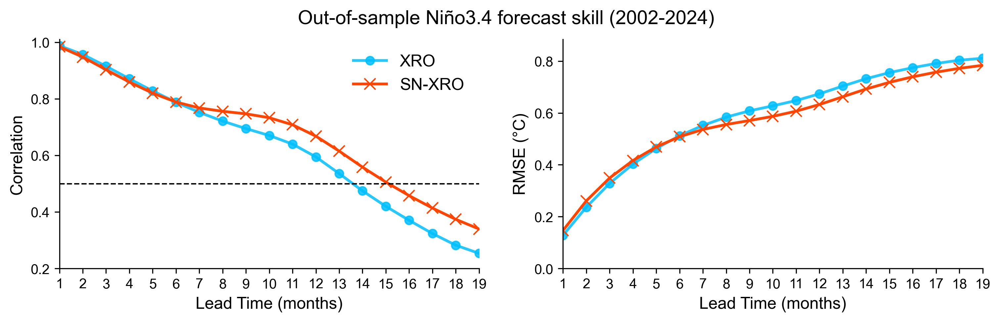
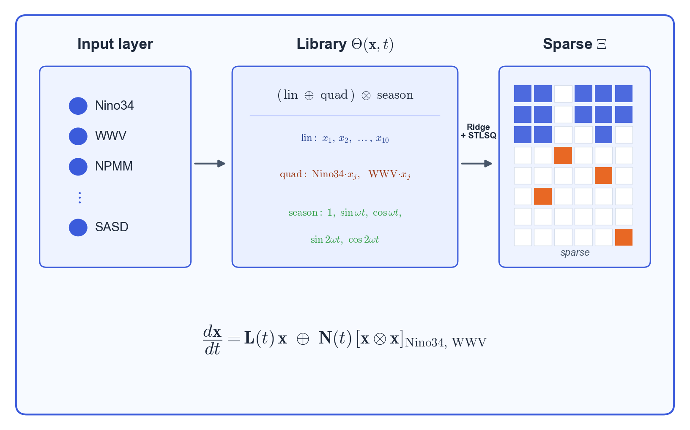
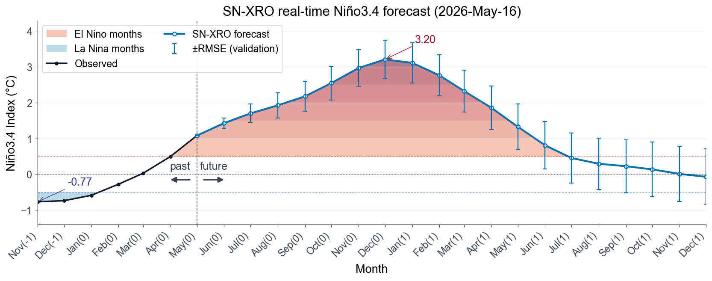

# XRO-pySINDy

基于 [PySINDy](https://github.com/dynamicslab/pysindy) 复现并扩展 [XRO 模型](https://github.com/senclimate/XRO)的 ENSO 实时预报工具包。

[**XRO**](https://github.com/senclimate/XRO)（Extended nonlinear Recharge Oscillator，
[Zhao et al., *Nature*, 2024](https://doi.org/10.1038/s41586-024-07534-6)）把 Niño3.4、WWV 等
10 个气候模态指数耦合成一个**季节调制的低阶动力系统**，其非线性项是物理预设的（Niño3.4、WWV
方程中的少数二次/三次自身项）。本项目把它作为基线，并用 [SINDy](https://github.com/dynamicslab/pysindy)
的**稀疏回归**改为对 Niño3.4、WWV 两个核心方程的**全部二次项做数据驱动的稀疏选择（STLSQ）**，得到
**SN-XRO（Sparse-Nonlinear Extended Recharge-Oscillator）**；训练后用 RK4 把系统从最新观测向前积分，
得到逐月预报。

**预报技巧（Niño3.4，训练 1979–2001 / 验证 2002–2024）。**
短提前期两者几乎一致；从约 6 个月起 SN-XRO 的数据驱动稀疏非线性逐渐胜出，到 lead 19 时距平相关
系数 0.34 vs 0.25（**+0.09**）、RMSE 也更低，把相关系数跌破 0.5 的可用预报上限**外推约 1–2 个月**。
技巧曲线由 [`evaluate.py`](evaluate.py) 一键复现（见 [评估与验证](#评估与验证)）：



---

## 快速开始

最短路径（约 30 秒跑通，用随项目附带的数据）：

```bash
# 1. 安装依赖
pip install -r requirements.txt

# 2. 一行跑通：读取 ORAS5 指数、训练 SN-XRO、给出预报图
python run_forecast.py
```

默认行为：读取 1979-present 的 10 个 ORAS5 指数 → 训练 SN-XRO 模型 → 以最新一个月为初值用 RK4
向前外推 20 个月 → 在 `figures/` 下生成形如 `realtime_Nino34_202605.png` 的预报图：
观测（黑）+ 预报（蓝），El Niño / La Niña 阈值分层填色，past/future 分界，并标注预报极值。

### 常用参数

```bash
python run_forecast.py --target WWV                      # 换一个预报目标
python run_forecast.py --horizon 12 --start 1979-01      # 改提前期 / 训练起始月
python run_forecast.py --data data/XRO_indices_oras5.nc  # 换数据集
```

| 参数 | 默认 | 说明 |
|------|------|------|
| `--data` | `data/oras5_indices_1958-2026-05.nc` | 指数 NetCDF 路径 |
| `--target` | `Nino34` | 预报的指数（须在变量列表中）|
| `--start` | `1979-01` | 训练起始月（建议某年 1 月，季节相位对齐）|
| `--horizon` | `20` | 预报提前期（月）|
| `--n-obs-show` | `6` | 图中展示的历史观测月数 |

---

## 稀疏非线性模型与 SINDy

SN-XRO 的训练流程一图概览：10 个指数 → 候选函数库 $\Theta(\mathbf{x},t)$（线性 ⊕ 二次，再 ⊗ 季节基）
→ Ridge + STLSQ 解出**稀疏**系数矩阵 $\Xi$（仅 Niño3.4/WWV 方程保留少数二次项）：



**动力系统与候选库。** 把 $n=10$ 个指数的距平堆成状态向量 $\mathbf{x}(t)\in\mathbb{R}^{n}$，
其逐月演变看作一个动力系统 $\dot{\mathbf{x}}=\mathbf{f}(\mathbf{x},t)$。[SINDy](https://github.com/dynamicslab/pysindy)
假设 $\mathbf{f}$ 可由一个**候选函数库** $\Theta$（线性、二次、……项）线性张成，且真正起作用的项**很少**：

$$\dot{\mathbf{X}} = \Theta(\mathbf{X},t)\,\Xi
\qquad \Theta=[\boldsymbol{\theta}_1,\ \boldsymbol{\theta}_2,\ \dots],$$

其中 $\Xi$ 是**稀疏**系数矩阵——大多数候选项的系数为 $0$，从而方程既可解释、又不过拟合。

**季节调制。** 每个系数都不是常数，而是随年循环变化，用 $a=$ `ac_order` 阶傅里叶基
$\boldsymbol{\phi}(t)$ 展开（$\omega=2\pi/12$，月为单位）：

$$\boldsymbol{\phi}(t)=\big[1,\ \sin\omega t,\ \cos\omega t,\ \dots,\ \sin a\omega t,\ \cos a\omega t\big].$$

**SN-XRO 的方程。** 第 $i$ 个指数的演变写成线性块 + 二次非线性块：

$$\dot{x}_i =
\underbrace{\sum_{j}\big(\mathbf{L}_{ij}\!\cdot\!\boldsymbol{\phi}(t)\big)\,x_j}_{\text{线性块（所有方程，Ridge 拟合）}}
+
\underbrace{\sum_{p\le q}\big(\mathbf{Q}^{(i)}_{pq}\!\cdot\!\boldsymbol{\phi}(t)\big)\,x_p x_q}_{\text{二次块（仅 }i\in\{\text{Niño3.4, WWV}\}\text{，STLSQ 稀疏回归）}}$$

线性块刻画 XRO 振子的主体动力；二次块只在 Niño3.4、WWV 两个核心方程启用，引入 ENSO 的非线性反馈。

**稀疏回归（STLSQ）。** 非线性块的系数用**序贯阈值最小二乘**求解——每轮先做岭回归，再把绝对值
小于阈值 $\lambda$（`threshold`）的系数置零，迭代至收敛：

$$\hat{\Xi}=\arg\min_{\Xi}\ \tfrac12\big\|\dot{\mathbf{X}}-\Theta(\mathbf{X})\,\Xi\big\|_2^2+\alpha\|\Xi\|_2^2,
\qquad \text{并令 } |\xi|<\lambda \text{ 的项 } \xi\!\leftarrow\!0 \text{ 后重复。}$$

线性块用岭回归（Ridge）保留全部线性项；二者由自定义优化器 `HybridOptimizer` 组合，特征库为
`SeasonalNonlinearLibrary`（`nth_only=True` 时只让 Niño3.4/WWV 带非线性项），均在
[`sindyro/core.py`](sindyro/core.py) 中。XRO 基线（[`build_xro_model`](sindyro/forecast.py)）则把
非线性项换成 XRO 原型物理预设的少数二次/三次自身项。

---

## 评估与验证

[`evaluate.py`](evaluate.py) 是一个最小评估程序：数据用 `data/XRO_indices_oras5.nc`（1979–2024），
训练 **1979–2001**（前 12×23 = 276 个月）、验证 **2002–2024**，对 SN-XRO 与 XRO 基线做滚动外推并
逐提前期评估技巧——**滚动 1 个月对应 lead 1，2 个月对应 lead 2**，依此类推（lead 0–19）。

```bash
python evaluate.py                       # 默认 Niño3.4，max-lead 19
python evaluate.py --target WWV          # 评估其它指数
python evaluate.py --raw-monthly         # 关闭 3 个月滑动平均，按逐月原始序列评估
```

产出两张图：

1. **技巧对比曲线** `figures/skill_comparison.png`（见上方第一节）：SN-XRO vs XRO 的相关系数与
   RMSE 随 lead 的变化。技巧按 ENSO 业务惯例对各 lead 序列做 3 个月滑动平均后计算
   （`--raw-monthly` 可关闭）。
2. **带误差棒的实时预报** `figures/realtime_<target>_errorbar_<YYYYMM>.png`：用**最新数据集**
   （`data/oras5_indices_1958-2026-05.nc`）重训 SN-XRO 做实时预报，并把验证集得到的
   **逐 lead RMSE 以 errorbar** 标注在预报曲线上——误差棒随提前期增大而展宽，直观反映预报不确定度。



> 误差棒来自训练/验证划分（仅用 1979–2001 训练）所得的逐 lead RMSE；实时预报曲线本身则由最新
> 数据集重训的 SN-XRO 给出，二者结合即"预报值 ± 历史同期误差"的不确定度估计。

---

## 目录结构

```
XRO-pySINDy/
├── run_forecast.py            # 最小实时预报脚本入口
├── evaluate.py                # 最小评估：SN-XRO vs XRO 技巧曲线 + 误差棒预报图
├── sindyro/
│   ├── __init__.py
│   ├── core.py                # 引擎：特征库 / 优化器 / RK4 积分器 / 技巧评估
│   └── forecast.py            # 高层封装：建模 / 实时预报 / 绘图
├── data/
│   ├── oras5_indices_1958-2026-05.nc   # 实时指数（默认，含至 2026-05）
│   └── XRO_indices_oras5.nc            # 备用（1979–2024）
├── figures/                   # 输出预报图
├── requirements.txt
└── README.md
```

---

## 数据说明

`data/*.nc` 为月度气候指数**距平**（anomaly）：`Nino34` 单位 °C，`WWV` 为暖水体积距平等。
若要更新到更新的月份，替换为同结构的 NetCDF 并用 `--data` 指定即可（变量名需一致）。
