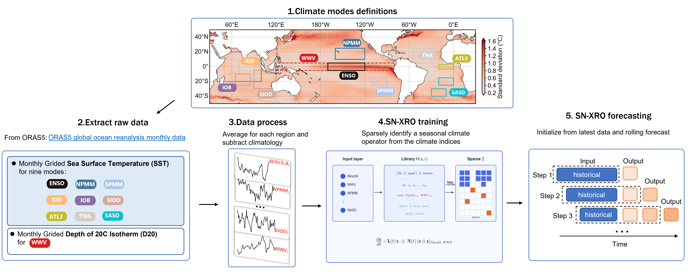
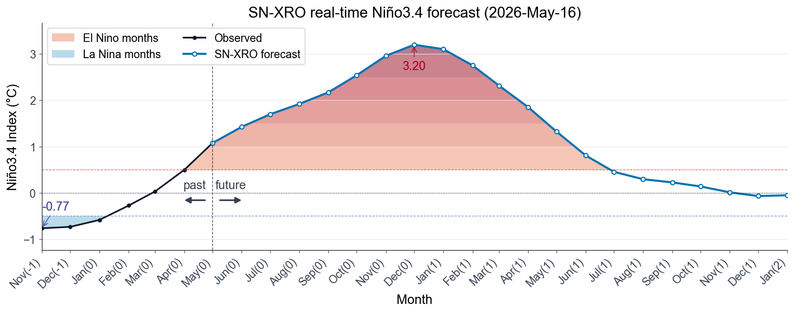

# REPORT

起报时间: 2026年5月 | 时效: 20个月 (2026-05 至 2028-01)

模型: SN-XRO（Sparse-Nonlinear XRO）| 项目: XRO-pySINDy

---

## 一、数据简介

### 原始数据

ORAS5 (Ocean ReAnalysis System 5) 由 ECMWF 运行，是 Copernicus C3S 全球海洋再分析产品，分辨率 0.25°×0.25°，垂向 75 层，覆盖 1958 年至今。同化系统为 NEMO 海洋模式 + NEMOVAR 3D-Var FGAT，同化卫星 SST、海面高度、Argo 温盐廓线及海冰密集度。

- 官网: https://www.ecmwf.int/en/research/climate-reanalysis/ocean-reanalysis
- 数据获取: https://cds.climate.copernicus.eu

本预报使用其中两个物理量：海表温度 (Sea Surface Temperature, SST `sosstsst`) 和 20°C 等温线深度 (Depth of 20°C isotherm, D20 `so20chgt`)。原始数据为逐月气候格点数据（空间分辨率 0.25°×0.25°，覆盖时间 1958-01 至 2026-05，长度 821 个月）。

### 处理后数据

**1. 构造区域时间序列：** 两个变量（**Variable**）的对应模式（**mode**）所指向区域（**Region**）按以下区域进行格点空间平均，每个模式得到一条时间序列，共计 10 条时间序列（时间长度 821 个月）：

| #    | Mode    | Full Name                         | Region (lat, lon)                            | Variable |
| ---- | ------- | --------------------------------- | -------------------------------------------- | -------- |
| 1    | Niño3.4 | Niño 3.4 Index                    | 5°S–5°N, 170°W–120°W                         | SST      |
| 2    | WWV     | Warm Water Volume                 | 5°S–5°N, 120°E–80°W                          | D20      |
| 3    | NPMM    | North Pacific Meridional Mode     | 10°–25°N, 160°W–120°W                        | SST      |
| 4    | SPMM    | South Pacific Meridional Mode     | 25°–15°S, 110°–90°W                          | SST      |
| 5    | IOB     | Indian Ocean Basin Mode           | 20°S–20°N, 40°–100°E                         | SST      |
| 6    | TNA     | Tropical North Atlantic Index     | 5°–25°N, 55°–15°W                            | SST      |
| 7    | ATL3    | Atlantic Niño 3 Index             | 3°S–3°N, 20°W–0°                             | SST      |
| 8    | IOD     | Indian Ocean Dipole               | (10°S–10°N, 50°–70°E) − (10°S–0°, 90°–110°E) | SST      |
| 9    | SIOD    | Southern Indian Ocean Dipole      | (25°–10°S, 65°–85°E) − (30°–5°S, 90°–120°E)  | SST      |
| 10   | SASD    | South Atlantic Subtropical Dipole | (40°–30°S, 30°–10°W) − (25°–15°S, 20°W–0°)   | SST      |

**2. 去季节循环：**

即计算月距平，设原始序列为 $X(t)$，$t$ 表示时间，$M(t)$ 表示气候态时间段对应的月份，月距平为：
$$
X'(t) = X(t) - \overline{X}_{M(t)}
$$

其中：

- $X(t)$：原始值
- $\overline{X}_{M(t)}$：气候态时间段对应的月份的序列平均值
- $X'(t)$：月距平

其中气候态时间段为 1979-01 至 2009-12。

**3. 去二次趋势：**

将时间转为月份序号 $\tau(t)$，并拟合二次趋势：

$$
\hat{X}'(t) = a\tau(t)^2 + b\tau(t) + c
$$

去趋势后为：

$$
X''(t) = X'(t) - \hat{X}'(t)
$$

其中：

- $\tau(t)$：从序列起点开始的月份序号
- $a,b,c$：二次趋势拟合系数
- $\hat{X}'(t)$：拟合趋势
- $X''(t)$：去二次趋势后的月距平

最终得到去季节循环、去二次趋势后的气候模式指数。本预报使用 **1979-01 至 2026-05** 共 569 个月作为训练样本（即"在 1979–present 上训练"），状态向量记为 $\mathbf{x}(t)=[\,N_{3.4},\,WWV,\,NPMM,\dots,SASD\,]^\top\in\mathbb{R}^{10}$。

## 二、预报算法和流程

***Figure:** SN-XRO 实时 ENSO 预报系统流程示意图。气候模态指数由 ORAS5 月度海洋再分析场按区域空间平均提取（各区域海表温度指数与赤道暖水体积 WWV），经去季节循环、去二次趋势处理后，用于训练 SN-XRO 模型——以 SINDy 从指数中稀疏辨识出季节调制的动力算子；模型再以最新可用观测为初值，滚动产生逐月实时预报。*

上图所示的 **1.区域定义**、**2.数据提取** 和 **3.数据处理** 环节已由第一部分介绍。下面介绍 **4.模型训练**（SN-XRO training）与 **5.模型预测**（SN-XRO forecasting）。

**SN-XRO** 是本项目在 **XRO（eXtended nonlinear Recharge Oscillator）** 框架基础上提出的创新方法。XRO 提供了"多海盆模态耦合 + 季节调制 + 极少量关键非线性"的物理骨架；与之不同，**SN-XRO 不预设方程参数，而是用 SINDy（Sparse Identification of Nonlinear Dynamics，稀疏动力学辨识）直接从观测中"学"出这套季节调制算子**，并以稀疏正则自动筛选出最必要的非线性项。这使模型在保持可解释、轻量的同时，由数据决定每条耦合与非线性的强弱。

**输入**：第一部分介绍的 10 个气候模态指数，以及年循环、半年循环的时间周期编码（Seasonal cycles）。

**输出**：状态导数 $d\mathbf{x}/dt$；通过数值积分滚动得到逐月预报。

**算法流程**：

1. **构造季节调制特征库 $\Theta(\mathbf{x},t)$**（`SeasonalNonlinearLibrary`）：将"线性项 / 选定二次项" $\otimes$ "季节基函数（年循环+半年循环，`ac_order=2`）"展开为候选函数矩阵。非线性二次项**仅施加于 Niño3.4 与 WWV 两个方程**（`nth_only`），其余模态保持线性。
2. **估计导数**：对训练序列用一阶有限差分得到 $\dot{\mathbf{x}}$。
3. **混合稀疏回归**（`HybridOptimizer`）：求解 $\dot{\mathbf{X}}\approx\Theta(\mathbf{X},t)\,\Xi$ 并令系数矩阵 $\Xi$ 稀疏——
   - **线性块**用 Ridge 回归拟合季节调制线性核 $\mathbf{L}(t)$；
   - **非线性块**对线性残差用 **STLSQ**（序贯阈值最小二乘）做稀疏选择，得到 $\mathbf{N}(t)$。
   - 辨识出的控制方程为：
   $$
   \frac{d\mathbf{x}}{dt}=\mathbf{L}(t)\,\mathbf{x}+\mathbf{N}(t)\big[\mathbf{x}\otimes\mathbf{x}\big]_{N_{3.4},\,WWV},\qquad
   \mathbf{L}(t),\mathbf{N}(t)=\sum_{k}\big[\mathbf{A}_k\cos k\omega t+\mathbf{B}_k\sin k\omega t\big],\ \ \omega=\tfrac{2\pi}{12}.
   $$
4. **滚动预报（RK4）**：以最新一个月观测为初值，用四阶 Runge–Kutta 逐月向前积分，季节相位随月份推进，共积分 20 个月。

**本次运行配置**：

| 项 | 取值 |
| --- | --- |
| 训练区间 | 1979-01 – 2026-05（569 个月）|
| 状态维数 | 10 个气候模态 |
| 季节阶数 `ac_order` | 2（年循环 + 半年循环）|
| 非线性 | 仅 Niño3.4、WWV 的二次项（`nth_only`）|
| 稀疏阈值 / 正则 | STLSQ `threshold=0.02`，`alpha_nonlinear=10`，Ridge `alpha_linear=0` |
| 积分器 / 时效 | RK4，逐月，20 个月 |

## 三、预报结果

***Figure:** SN-XRO real-time Niño3.4 forecast initialized on 16 May 2026. 黑线为起报前的观测 Niño3.4，蓝线为 SN-XRO 之后的预报。红/蓝分层填色标记超过 El Niño / La Niña 阈值的月份（颜色越深异常越强）；竖直虚线分隔观测与预报，标注值为最强冷/暖异常。*

本次预测初始化时间为 **2026 年 5 月 16 日**，此时 Niño3.4 已升至约 **+1.08°C**，处于 El Niño 状态（起报前的 2025 年底曾出现弱 La Niña，最低约 −0.77°C）。SN-XRO 预测暖异常将在 2026 年夏秋季持续快速增强，并于 **2026 年 12 月前后达到峰值，约 +3.20°C**，对应一次**强 El Niño 事件**。

2027 年初起暖异常迅速衰减，预计在 **2027 年 7 月前后** 回落至 +0.5°C 阈值以下，转入中性。此后至预报末端（2028 年 1 月），Niño3.4 维持中性并略偏冷（约 −0.05°C），**预报期内未达到 La Niña 阈值**。

总体来看，SN-XRO 预测倾向于 **2026 年发展为一次较强 El Niño 事件**，成熟期在 **2026 年冬季**，于2026年12月达到峰值，随后于 2027 年中快速回归中性。
